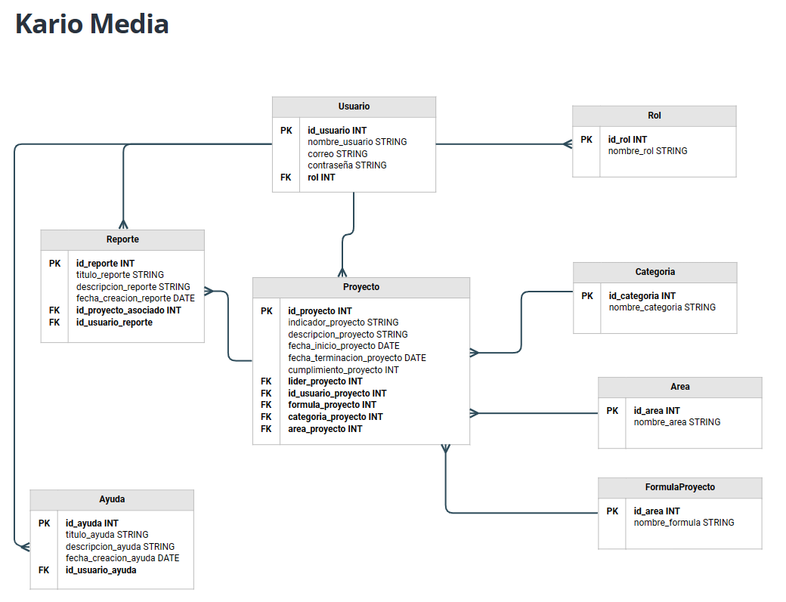

# Sistema de Gestión de Proyectos - Documentación
Este README tiene como objetivo proporcionar una descripción general del Sistema de Gestión de Proyectos desarrollado para la empresa "Kario Media". El sistema está diseñado para facilitar la administración y seguimiento de proyectos en el contexto de licitaciones públicas y privadas de varios nichos de negocio.

## Tablas y relaciones
El sistema utiliza varias tablas para almacenar y gestionar datos clave relacionados con proyectos, usuarios y otras entidades. A continuación, se describen las tablas y sus relaciones:

### Usuario
- id_usuario (INT): Identificador único de usuario.
- nombre_usuario (STRING): Nombre del usuario.
- correo (STRING): Correo electrónico del usuario.
- contraseña (STRING): Contraseña del usuario.
- rol (INT): ID del rol asignado al usuario.

### Rol
- id_rol (INT): Identificador único de rol.
- nombre_rol (STRING): Nombre del rol.

### Proyecto
- id_proyecto (INT): Identificador único de proyecto.
- indicador_proyecto (STRING): Indicador del proyecto.
- descripcion_proyecto (STRING): Descripción del proyecto.
- fecha_inicio_proyecto (DATE): Fecha de inicio del proyecto.
- fecha_terminacion_proyecto (DATE): Fecha de terminación del proyecto.
- cumplimiento_proyecto (INT): Cumplimiento del proyecto.
- lider_proyecto (INT): ID del usuario que lidera el proyecto.
- id_usuario_proyecto (INT): ID del usuario asociado al proyecto.
- formula_proyecto (INT): ID de la fórmula utilizada en el proyecto.
- categoria_proyecto (INT): ID de la categoría del proyecto.
- area_proyecto (INT): ID del área asociada al proyecto.

### Categoria
- id_categoria (INT): Identificador único de categoría.
- nombre_categoria (STRING): Nombre de la categoría.

### Area
- id_area (INT): Identificador único del área.
- nombre_area (STRING): Nombre del área.

### FormulaProyecto
- id_formula (INT): Identificador único de la fórmula del proyecto.
- nombre_formula (STRING): Nombre de la fórmula del proyecto.

### Reporte
- id_reporte (INT): Identificador único del reporte.
- titulo_reporte (STRING): Título del informe.
- descripcion_reporte (STRING): Descripción del informe.
- fecha_creacion_reporte (DATE): Fecha de creación del informe.
- id_proyecto_asociado (INT): ID del proyecto asociado al informe.
- id_usuario_reporte (INT): ID del usuario que creó el informe.

### Ayuda
- id_ayuda (INT): Identificador único de la ayuda.
- titulo_ayuda (STRING): Título de la ayuda.
- descripcion_ayuda (STRING): Descripción de la ayuda.
- fecha_creacion_ayuda (DATE): Fecha de creación de la ayuda.
- id_usuario_ayuda (INT): ID del usuario que creó la ayuda.

## Propósito del Sistema
El propósito principal de este sistema es permitir a la empresa "Kario Media" gestionar eficazmente sus proyectos, desde su creación hasta su finalización. Las principales funcionalidades del sistema incluyen:

- Registro y gestión de usuarios con roles y permisos.
- Creación y seguimiento de proyectos con detalles como fechas, categorías y áreas asociadas.
- Solicitud de ayuda y asistencia por parte de los usuarios.
- Seguimiento de las solicitudes de ayuda y su resolución.

El sistema está diseñado para mejorar la eficiencia en la gestión de proyectos y proporcionar una plataforma centralizada para colaborar en proyectos, generar informes y obtener ayuda cuando sea necesario.